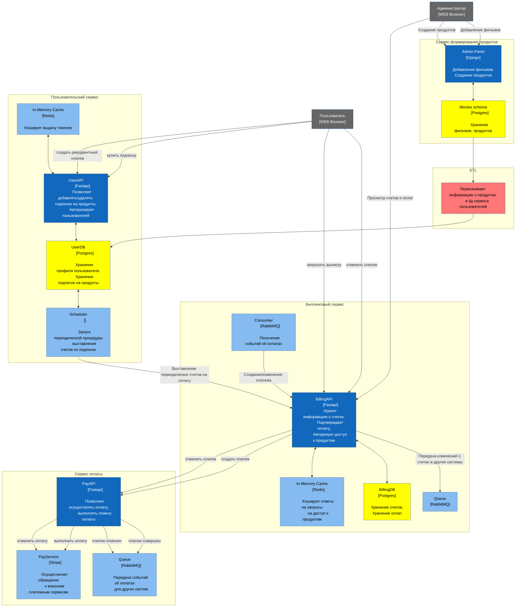

```mermaid
%%%%{
%%    init: {
%%        "flowchart": {"defaultRenderer": "elk" }
%%    }
%%}%%
flowchart TB
    
    Admin["Администратор\n[WEB Browser]"] 
        
    Client["Пользователь\n[WEB Browser]"]

    subgraph "ETL"
    
    Admin_panel_TO_UserService["
        Перекачивает информацию о продуктах 
        в бд сервиса пользователей
    "]
    
    end    
        
    subgraph "Сервис формирования продуктов"
        
        AdminPanel["Admin Panel
            [Django]
            
            Добавление фильмов,
            Создание продуктов"]
        
        MovieDB["Movies schema
            [Postgres]
            
            Хранение фильмов, продуктов"]
            
            AdminPanel<-->MovieDB
    end
    
    subgraph "Биллинговый сервис"
        BillingAPI["BillingAPI
            [Fastapi]
            Хранит информацию о счетах,
            Подтверждает оплату,
            Авторизует доступ к продуктам
            "]
                    
        Queue2["Queue
            [RabbitMQ]
            
            "]
            
        BillingDB["BillingDB
            [Postgres]
            
            Хранение счетов,
            Хранение оплат"]
            
        BillingCache["In-Memory Cache
            [Redis]
            
            Кэширует ответы на запросы
            на доступ к продуктам"]
            
        BillingQueue["Consumer
            [RabbitMQ]
            
            Получение событий об оплатах"]
        
        BillingAPI--"Передача изменений о счетах в другие системы"-->Queue2
        BillingAPI<-->BillingDB
        BillingAPI<-->BillingCache
        BillingQueue--"Создание/изменение платежа"-->BillingAPI
    
    end
     
     
    subgraph "Сервис оплаты"
        PayAPI["PayAPI
            [Fastapi]
            
            Позволяет осуществлять оплату,
            выполнять отмену оплаты"]
    
        PayService["PayService
            [Stripe]
            
            Осуществляет обращение
            к внешним платежным сервисам"]
        
        Queue["Queue
            [RabbitMQ]
            
            Передача событий об оплатах
            для других систем"]
            
        PayAPI--"платеж совершен"-->Queue
        PayAPI--"платеж отменен"-->Queue
        PayAPI--"выполнить оплату"-->PayService
        PayAPI--"отменить оплату"-->PayService
        
    end
    
    
    subgraph "Пользовательский сервис"
        UserAPI["UserAPI
            [Fastapi]
            Позволяет добавлять/удалять подписки на продукты,
            Авторизирует пользователей"]

        
        UserDB["UserDB
            [Postgres]
            
            Хранение профиля пользователя,
            Хранение подписок на продукты"]
            
        Scheduler["Scheduler
            []
            
            Запуск периодической процедуры
            выставления счетов по подписке"]
        
        Cache["In-Memory Cache
            [Redis]
            
            Кэширует выдачу токенов"]

        Cache<-->UserAPI
        UserDB<-->Scheduler
        UserAPI<-->UserDB

        


    end

    
    
    Client--"купить подписку"-->UserAPI
    Client--"отменить платеж"-->BillingAPI
    Client--"создать рекуррентный платеж"-->UserAPI
    Client--"запросить выписку"-->BillingAPI

    Admin--"Добавление фильмов"-->AdminPanel
    Admin--"Создание продуктов"-->AdminPanel
    Admin--"Просмотр счетов и оплат"-->BillingAPI
        
    BillingAPI--"создать платеж"-->PayAPI
    BillingAPI--"отменить платеж"-->PayAPI
        
    MovieDB-->Admin_panel_TO_UserService
    Admin_panel_TO_UserService-->UserDB
    
    Scheduler--"Выставление периодических счетов на оплату"-->BillingAPI
    
    class AdminPanel api
    class PayAPI api
    class UserAPI api
    class BillingAPI api
    
    class EntitlementService service
    class UserService service

    class PayService service
    class Scheduler service
    class Client client
    class Admin client
    
    
    class Cache service
    class BillingCache service
    
    class Queue service
    class Queue2 service
    class BillingQueue service
    
    
    class MovieDB database
    class UserDB database
    class EntitlementDB database
    class BillingDB database
    
    class Admin_panel_TO_UserService etl
    
    classDef api fill:#1168bd, stroke:#0b4884, color:#ffffff
    classDef client fill:#666, stroke:#0b4884, color:#ffffff
    classDef service fill:#85bbf0, stroke:#5d82a8, color:#000000
    classDef database fill:#ffff00, stroke:#5d82a8, color:#000000
    classDef etl fill:#ff7777, stroke:#5d82a8, color:#000000
```
