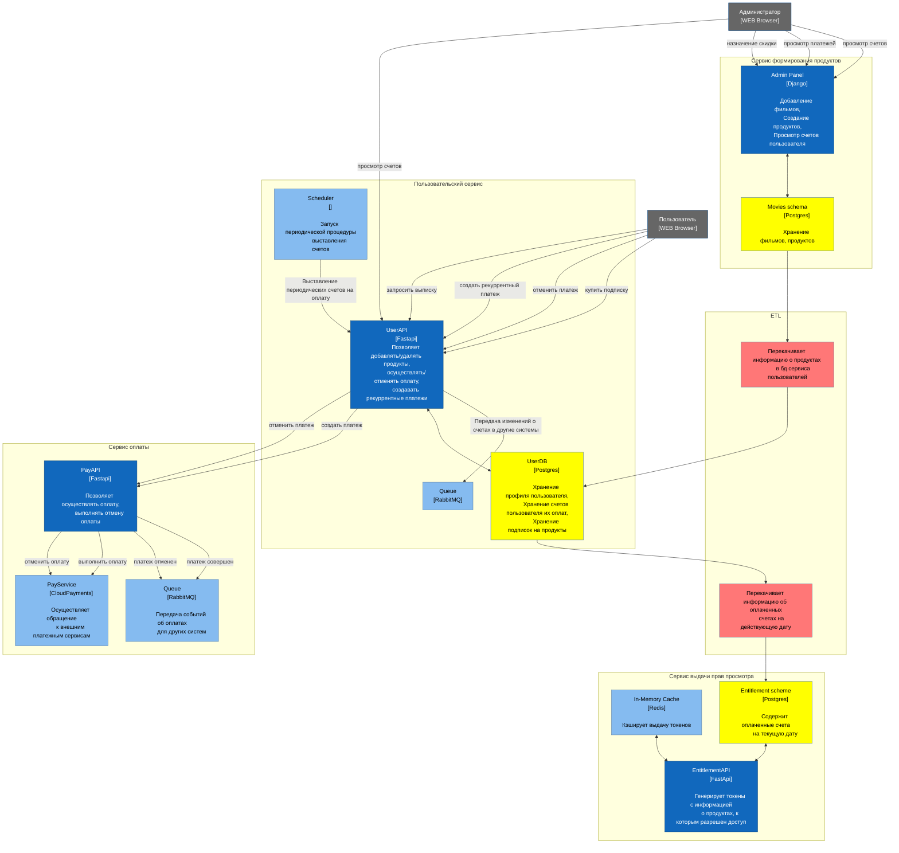

```mermaid
%%%%{
%%    init: {
%%        "flowchart": {"defaultRenderer": "elk" }
%%    }
%%}%%
flowchart TB
    
    Admin["Администратор
    [WEB Browser]"] 
        
    Client["Пользователь
    [WEB Browser]"]
        

    subgraph "ETL"
    
    Admin_panel_TO_UserService["
        Перекачивает информацию о продуктах 
        в бд сервиса пользователей
    "]
    
    UserService_TO_EntitlementService["
        Перекачивает информацию об оплаченных
        счетах на действующую дату
    "]
    
    end    
        
    subgraph "Сервис формирования продуктов"
        
        AdminPanel["Admin Panel
            [Django]
            
            Добавление фильмов,
            Создание продуктов,
            Просмотр счетов пользователя"]
        
        MovieDB["Movies schema
            [Postgres]
            
            Хранение фильмов, продуктов"]
            
            AdminPanel<-->MovieDB
    end
    
    
    subgraph "Пользовательский сервис"
        UserAPI["UserAPI
            [Fastapi]
            Позволяет добавлять/удалять продукты,
            осуществлять/отменять оплату,
            создавать рекуррентные платежи"]
        
        Queue2["Queue
            [RabbitMQ]
            
            "]
        
        UserDB["UserDB
            [Postgres]
            
            Хранение профиля пользователя,
            Хранение счетов пользователя их оплат,
            Хранение подписок на продукты"]
            
        Scheduler["Scheduler
            []
            
            Запуск периодической процедуры
            выставления счетов"]
            
        Scheduler--"Выставление периодических счетов на оплату"-->UserAPI
        UserAPI--"Передача изменений о счетах в другие системы"-->Queue2
        UserAPI<-->UserDB
    end
    
    subgraph "Сервис оплаты"
        PayAPI["PayAPI
            [Fastapi]
            
            Позволяет осуществлять оплату,
            выполнять отмену оплаты"]
    
        PayService["PayService
            [CloudPayments]
            
            Осуществляет обращение
            к внешним платежным сервисам"]
        
        Queue["Queue
            [RabbitMQ]
            
            Передача событий об оплатах
            для других систем"]
            
        PayAPI--"платеж совершен"-->Queue
        PayAPI--"платеж отменен"-->Queue
        PayAPI--"выполнить оплату"-->PayService
        PayAPI--"отменить оплату"-->PayService
        
        end
    
    subgraph "Сервис выдачи прав просмотра"
        
        EntitlementAPI["EntitlementAPI
            [FastApi]
            
            Генерирует токены с информацией
            о продуктах, к которым разрешен доступ"]
        
        Cache["In-Memory Cache
            [Redis]
            
            Кэширует выдачу токенов"]
        
        EntitlementDB["Entitlement scheme
            [Postgres]
            
            Содержит оплаченные счета
            на текущую дату"]

        EntitlementDB<-->EntitlementAPI
        Cache<-->EntitlementAPI
    end
    
    Client--"купить подписку"-->UserAPI
    Client--"отменить платеж"-->UserAPI
    Client--"создать рекуррентный платеж"-->UserAPI
    Client--"запросить выписку"-->UserAPI

    Admin--"просмотр счетов"-->AdminPanel
    Admin--"просмотр платежей"-->AdminPanel
    Admin--"назначение скидки"-->AdminPanel
    Admin--"просмотр счетов"-->UserAPI
        
    UserAPI--"создать платеж"-->PayAPI
    UserAPI--"отменить платеж"-->PayAPI
        
    MovieDB-->Admin_panel_TO_UserService
    Admin_panel_TO_UserService-->UserDB
    
    UserDB-->UserService_TO_EntitlementService
    UserService_TO_EntitlementService-->EntitlementDB

    
    class EntitlementAPI api
    class AdminPanel api
    class PayAPI api
    class UserAPI api
    
    class EntitlementService service
    class UserService service
    class Cache service
    class PayService service
    class Scheduler service
    class Client client
    class Admin client
    
    class Queue service
    class Queue2 service
    
    class MovieDB database
    class UserDB database
    class EntitlementDB database
    
    class Admin_panel_TO_UserService etl
    class UserService_TO_EntitlementService etl
    
    classDef api fill:#1168bd, stroke:#0b4884, color:#ffffff
    classDef client fill:#666, stroke:#0b4884, color:#ffffff
    classDef service fill:#85bbf0, stroke:#5d82a8, color:#000000
    classDef database fill:#ffff00, stroke:#5d82a8, color:#000000
    classDef etl fill:#ff7777, stroke:#5d82a8, color:#000000
```
