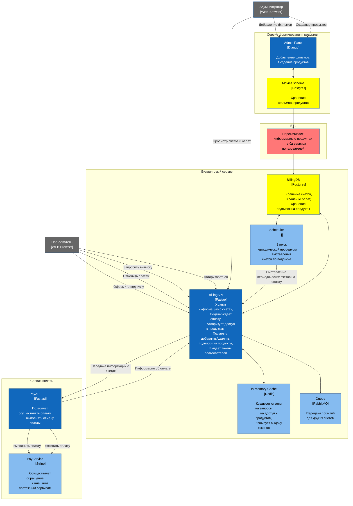

```mermaid
%%%%{
%%    init: {
%%        "flowchart": {"defaultRenderer": "elk" }
%%    }
%%}%%
flowchart TB
    
    
    Admin["Администратор\n[WEB Browser]"] 
        
    Client["Пользователь\n[WEB Browser]"]
    
    Client--"Оформить подписку"-->BillingAPI
    Client--"Отменить платеж"-->BillingAPI
    Client--"Запросить выписку"-->BillingAPI
    Client--"Авторизоваться"-->BillingAPI

    subgraph "ETL"
    
    Admin_panel_TO_UserService["
        Перекачивает информацию о продуктах 
        в бд сервиса пользователей
    "]
    
    end
        
    subgraph "Сервис формирования продуктов"
        
        AdminPanel["Admin Panel
            [Django]
            
            Добавление фильмов,
            Создание продуктов"]
        
        MovieDB["Movies schema
            [Postgres]
            
            Хранение фильмов, продуктов"]
            
            AdminPanel<-->MovieDB
    end
    
    subgraph "Биллинговый сервис"
        BillingAPI["BillingAPI
            [Fastapi]
            Хранит информацию о счетах,
            Подтверждает оплату,
            Авторизует доступ к продуктам,
            Позволяет добавлять/удалять подписки на продукты,
            Выдает токены пользователей
            "]
                    
        BillingDB["BillingDB
            [Postgres]
            
            Хранение счетов,
            Хранение оплат,
            Хранение подписок на продукты"]
            
        BillingCache["In-Memory Cache
            [Redis]
            
            Кэширует ответы на запросы
            на доступ к продуктам,
            Кэширует выдачу токенов"]
            
        Scheduler["Scheduler
            []
            
            Запуск периодической процедуры
            выставления счетов по подписке"]
        
        Queue["Queue
            [RabbitMQ]
            
            Передача событий
            для других систем"]
        
        BillingAPI<-->BillingDB
        BillingAPI<-->BillingCache
        BillingDB<-->Scheduler
        BillingAPI-->Queue

    end
     
     
    subgraph "Сервис оплаты"
        PayAPI["PayAPI
            [Fastapi]
            
            Позволяет осуществлять оплату,
            выполнять отмену оплаты"]
    
        PayService["PayService
            [Stripe]
            
            Осуществляет обращение
            к внешним платежным сервисам"]
            
        PayAPI--"Информация об оплате"-->BillingAPI
        PayAPI--"выполнить оплату"-->PayService
        PayAPI--"отменить оплату"-->PayService
        
    end
    
    

    Admin--"Добавление фильмов"-->AdminPanel
    Admin--"Создание продуктов"-->AdminPanel
    Admin--"Просмотр счетов и оплат"-->BillingAPI
        
    BillingAPI--"Передача информации о счетах"-->PayAPI
        
    MovieDB-->Admin_panel_TO_UserService
    Admin_panel_TO_UserService-->BillingDB
    
    Scheduler--"Выставление периодических счетов на оплату"-->BillingAPI
    
    class AdminPanel api
    class PayAPI api
    class UserAPI api
    class BillingAPI api
    
    class EntitlementService service
    class UserService service

    class PayService service
    class Scheduler service
    class Client client
    class Admin client
    
    
    class Cache service
    class BillingCache service
    
    class Queue service
    class Queue2 service
    class BillingQueue service
    
    
    class MovieDB database
    class UserDB database
    class EntitlementDB database
    class BillingDB database
    
    class Admin_panel_TO_UserService etl
    
    classDef api fill:#1168bd, stroke:#0b4884, color:#ffffff
    classDef client fill:#666, stroke:#0b4884, color:#ffffff
    classDef service fill:#85bbf0, stroke:#5d82a8, color:#000000
    classDef database fill:#ffff00, stroke:#5d82a8, color:#000000
    classDef etl fill:#ff7777, stroke:#5d82a8, color:#000000
    
```

