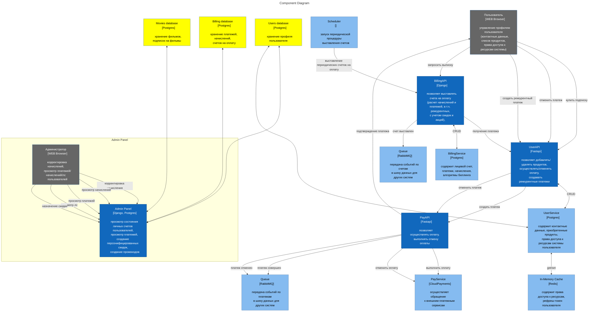

```mermaid
---
title: Component Diagram
---
flowchart TD
    classDef api fill:#1168bd, stroke:#0b4884, color:#ffffff
    classDef client fill:#666, stroke:#0b4884, color:#ffffff
    classDef service fill:#85bbf0, stroke:#5d82a8, color:#000000
    classDef database fill:#ffff00, stroke:#5d82a8, color:#000000
    
    Movies["Movies database
    [Postgres]
    
    хранение фильмов, подписок на фильмы"]
    
    Users["Users database
    [Postgres]
    
    хранение профиля пользователя"]
    
    Billing["Billing database
    [Postgres]
    
    хранение платежей, начислений,
    счетов на оплату"]
    
    Admin["Администратор
    [WEB Browser]
    
    корректировка начислений,
    просмотр платежей/начислений/лс
    пользователей"]
    
    AdminPanel["Admin Panel
    [Django, Postgres]
    
    просмотр состояния личных счетов пользователей,
    просмотр платежей, создание персонифицированных скидок,
    создание промокодов"]
    
    Client["Пользователь
    [WEB Browser]
    
    управление профилем пользователя
    (контактные данные, список продуктов,
    права доступа к ресурсам системы)"]
    
    UserAPI["UserAPI
    [Fastapi]
    
    позволяет добавлять/удалять продуктов,
    осуществлять/отменять оплату,
    создавать реккурентные платежи"]
    
    UserService["UserService
    [Postgres]
    
    содержит контактные данные, приобретенные продукты,
    права доступа к ресурсам системы пользователя"]
    
    Cache["In-Memory Cache
    [Redis]
    
    содержит права доступа к ресурсам,
    рефреш-токен пользователя"]
    
    PayAPI["PayAPI
    [Fastapi]
    
    позволяет осуществлять оплату,
    выполнять отмену оплаты"]
    
    PayService["PayService
    [CloudPayments]
    
    осуществляет обращение
    к внешним платежным сервисам"]
    
    BillingAPI["BillingAPI
    [Django]
    
    позволяет выставлять счета на оплату
    (расчет начислений и платежей, в т.ч. реккурентных,
    с учетом скидок и акций),"]
    
    BillingService["BillingService
    [Postgres]
    
    содержит лицевой счет,
    платежи, начисления,
    алгоритмы биллинга"]
    
    Scheduler["Scheduler
    []
    
    запуск периодической процедуры
    выставления счетов"]
    
    Queue1["Queue
    [RabbitMQ]
    
    передача событий по платежам
    в шину данных для других систем"]
    
    Queue2["Queue
    [RabbitMQ]
    
    передача событий по счетам
    в шину данных для других систем"]
    
    subgraph Admin Panel
        Admin--"корректировка начисления"-->AdminPanel
        Admin--"просмотр начислений"-->AdminPanel
        Admin--"просмотр платежей"-->AdminPanel
        Admin--"просмотр лс"-->AdminPanel
        Admin--"назначение скидки"-->AdminPanel
    end

    Billing<---->AdminPanel
    Movies<---->AdminPanel
    Users<---->AdminPanel
    Users<---->UserService
    Client--"купить подписку"-->UserAPI
    Client--"отменить платеж"-->UserAPI
    Client--"создать реккурентный платеж"-->UserAPI
    Client--"запросить выписку"-->BillingAPI
    UserAPI<--"CRUD"-->UserService
    UserService<--"get/set"-->Cache
    BillingAPI--"получение платежа"-->UserAPI
    BillingAPI<--"CRUD"-->BillingService
    UserAPI--"создать платеж"-->PayAPI     
    UserAPI--"отменить платеж"-->PayAPI
    Scheduler--"выставление периодических счетов на оплату"-->BillingAPI
    PayAPI--"выполнить оплату"-->PayService
    PayAPI--"отменить оплату"-->PayService
    PayAPI--"платеж совершен"-->Queue1
    PayAPI--"платеж отменен"-->Queue1
    PayAPI--"подтверждение платежа"-->Client
    BillingAPI--"счет выставлен"-->Queue2
    class UserAPI api
    class AdminPanel api
    class UserService service
    class Cache service
    class PayAPI api
    class PayService service
    class BillingAPI api
    class BillingService service
    class Scheduler service
    class Client client
    class Admin client
    class Queue1 service
    class Queue2 service
    class Movies database
    class Users database
    class Billing database
```