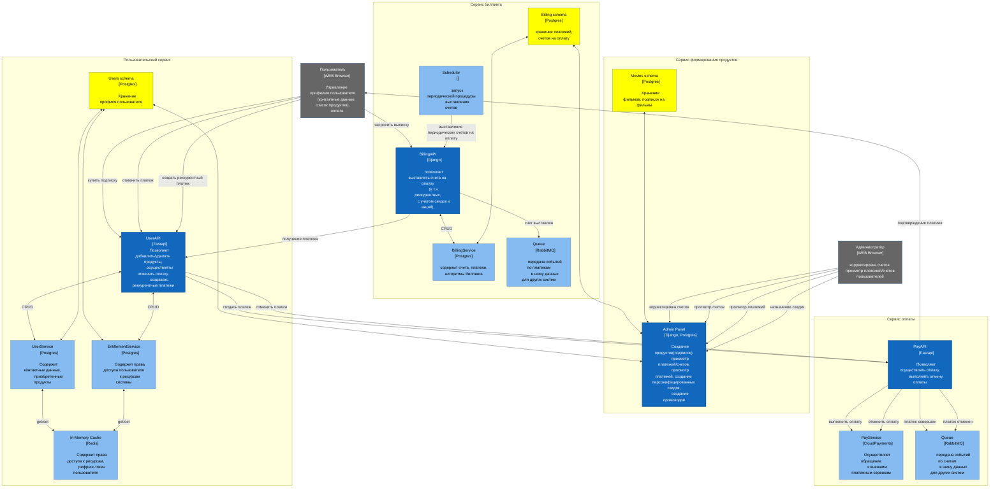

```mermaid
flowchart TB
    
    Client["Пользователь
        [WEB Browser]
        
        Управление профилем пользователя
        (контактные данные, список продуктов),
        оплата"]
    
    Admin["Администратор
        [WEB Browser]
        
        корректировка счетов,
        просмотр платежей/счетов
        пользователей"]
        
    subgraph Сервис формирования продуктов
        
        Movies["Movies schema
            [Postgres]
            
            Хранение фильмов, подписок на фильмы"]
            
        AdminPanel["Admin Panel
            [Django, Postgres]
            
            Создание продуктов(подписок),
            просмотр платежей/счетов,
            просмотр платежей, создание персонифицированных скидок,
            создание промокодов"]
    end
    
    subgraph Пользовательский сервис
        UserAPI["UserAPI
            [Fastapi]
            Позволяет добавлять/удалять продукты,
            осуществлять/отменять оплату,
            создавать реккурентные платежи"]
        
        UserService["UserService
            [Postgres]
            
            Содержит контактные данные,
            приобретенные продукты"]
        
        Users["Users schema
            [Postgres]
            
            Хранение профиля пользователя"]
        
        EntitlementService["EntitlementService
            [Postgres]
            
            Содержит права доступа пользователя
            к ресурсам системы"]
        
        Cache["In-Memory Cache
            [Redis]
            
            Содержит права доступа к ресурсам,
            рефреш-токен пользователя"]
    end
    
    subgraph Сервис оплаты
        PayAPI["PayAPI
            [Fastapi]
            
            Позволяет осуществлять оплату,
            выполнять отмену оплаты"]
    
        PayService["PayService
            [CloudPayments]
            
            Осуществляет обращение
            к внешним платежным сервисам"]
        
        Queue1["Queue
            [RabbitMQ]
            
            передача событий по счетам
            в шину данных для других систем"]
    end
    
    subgraph Сервис биллинга
        BillingAPI["BillingAPI
            [Django]
            
            позволяет выставлять счета на оплату
            (в т.ч. реккурентных,
            с учетом скидок и акций),"]
        
        BillingService["BillingService
            [Postgres]
            
            содержит счета, платежи,
            алгоритмы биллинга"]
        
        Billing["Billing schema
            [Postgres]
            
            хранение платежей,
            счетов на оплату"]
        
        Scheduler["Scheduler
            []
            
            запуск периодической процедуры
            выставления счетов"]
    
        Queue2["Queue
            [RabbitMQ]
            
            передача событий по платежам
            в шину данных для других систем"]
    end
    
    Billing<---->AdminPanel
    Movies<---->AdminPanel
    Users<---->AdminPanel
    
    Admin--"корректировка счетов"-->AdminPanel
    Admin--"просмотр счетов"-->AdminPanel
    Admin--"просмотр платежей"-->AdminPanel
    Admin--"назначение скидки"-->AdminPanel

    UserAPI<--"CRUD"-->UserService
    UserService<--"get/set"-->Cache
    EntitlementService<--"get/set"-->Cache
    Users<---->UserService
    Users<---->EntitlementService
    UserAPI<--"CRUD"-->EntitlementService
    
    Client--"купить подписку"-->UserAPI
    Client--"отменить платеж"-->UserAPI
    Client--"создать реккурентный платеж"-->UserAPI
    Client--"запросить выписку"-->BillingAPI
    BillingAPI--"получение платежа"-->UserAPI

    UserAPI--"создать платеж"-->PayAPI     
    UserAPI--"отменить платеж"-->PayAPI

    BillingAPI<--"CRUD"-->BillingService
    Scheduler--"выставление периодических счетов на оплату"-->BillingAPI
    Billing<---->BillingService

    PayAPI--"выполнить оплату"-->PayService
    PayAPI--"отменить оплату"-->PayService
    
    PayAPI--"платеж совершен"-->Queue1
    PayAPI--"платеж отменен"-->Queue1
    
    PayAPI--"подтверждение платежа"-->Client
    BillingAPI--"счет выставлен"-->Queue2
    
    class UserAPI api
    class AdminPanel api
    class UserService service
    class EntitlementService service
    class Cache service
    class PayAPI api
    class PayService service
    class BillingAPI api
    class BillingService service
    class Scheduler service
    class Client client
    class Admin client
    class Queue1 service
    class Queue2 service
    class Movies database
    class Users database
    class Billing database
    
    classDef api fill:#1168bd, stroke:#0b4884, color:#ffffff
    classDef client fill:#666, stroke:#0b4884, color:#ffffff
    classDef service fill:#85bbf0, stroke:#5d82a8, color:#000000
    classDef database fill:#ffff00, stroke:#5d82a8, color:#000000
```