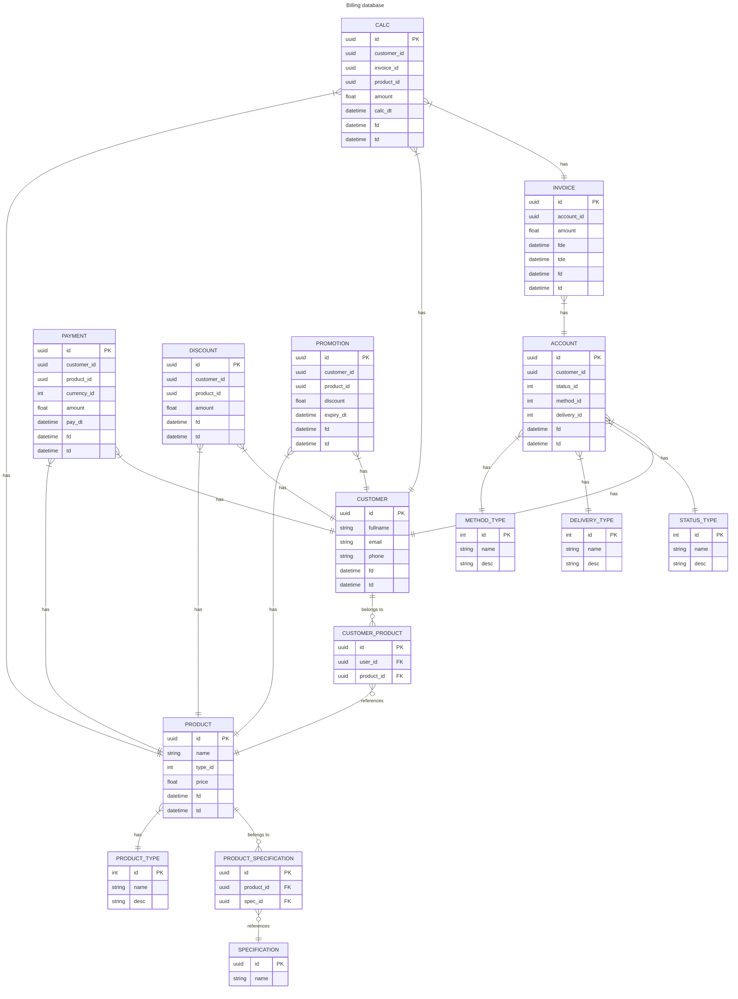

```mermaid
---
title: Billing database
---
erDiagram
ACCOUNT {
    uuid id PK 
    uuid customer_id
    int status_id
    int method_id
    int delivery_id
    datetime fd
    datetime td
}
CUSTOMER {
    uuid id PK
    string fullname
    string email
    string phone
    datetime fd
    datetime td
}
CALC {
    uuid id PK 
    uuid customer_id
    uuid invoice_id
    uuid product_id
    float amount
    datetime calc_dt
    datetime fd
    datetime td
}
PAYMENT {
    uuid id PK
    uuid customer_id
    uuid product_id
    int currency_id
    float amount
    datetime pay_dt
    datetime fd
    datetime td
}
STATUS_TYPE {
    int id PK
    string name
    string desc
}
DELIVERY_TYPE {
    int id PK
    string name
    string desc
}
METHOD_TYPE {
    int id PK
    string name
    string desc
}
INVOICE {
    uuid id PK
    uuid account_id
    float amount
    datetime fde
    datetime tde
    datetime fd
    datetime td
}
DISCOUNT {
    uuid id PK
    uuid customer_id
    uuid product_id
    float amount
    datetime fd
    datetime td
}
PROMOTION {
    uuid id PK
    uuid customer_id
    uuid product_id
    float discount
    datetime expiry_dt
    datetime fd
    datetime td
}
PRODUCT {
    uuid id PK 
    string name
    int type_id
    float price
    datetime fd
    datetime td
}
PRODUCT_SPECIFICATION {
    uuid id PK
    uuid product_id FK
    uuid spec_id FK
}
SPECIFICATION {
    uuid id PK
    string name
}
CUSTOMER_PRODUCT {
    uuid id PK
    uuid user_id FK
    uuid product_id FK
}
PRODUCT_TYPE {
    int id PK
    string name
    string desc
}
ACCOUNT }|--|| CUSTOMER: has
DISCOUNT }|--|| CUSTOMER: has
PROMOTION }|--|| CUSTOMER: has
ACCOUNT }|--|| STATUS_TYPE: has
ACCOUNT }|--|| DELIVERY_TYPE: has
ACCOUNT }|--|| METHOD_TYPE: has
CALC }|--|| INVOICE: has
PAYMENT }|--|| CUSTOMER: has
CALC }|--|| CUSTOMER: has
INVOICE }|--|| ACCOUNT: has
PAYMENT }|--|| PRODUCT: has
CALC }|--|| PRODUCT: has
DISCOUNT }|--|| PRODUCT: has
PROMOTION }|--|| PRODUCT: has
PRODUCT ||--o{ PRODUCT_SPECIFICATION: "belongs to"
PRODUCT_SPECIFICATION }o--|| SPECIFICATION: references
CUSTOMER ||--o{ CUSTOMER_PRODUCT: "belongs to"
CUSTOMER_PRODUCT }o--|| PRODUCT: references
PRODUCT }|--|| PRODUCT_TYPE: has
```