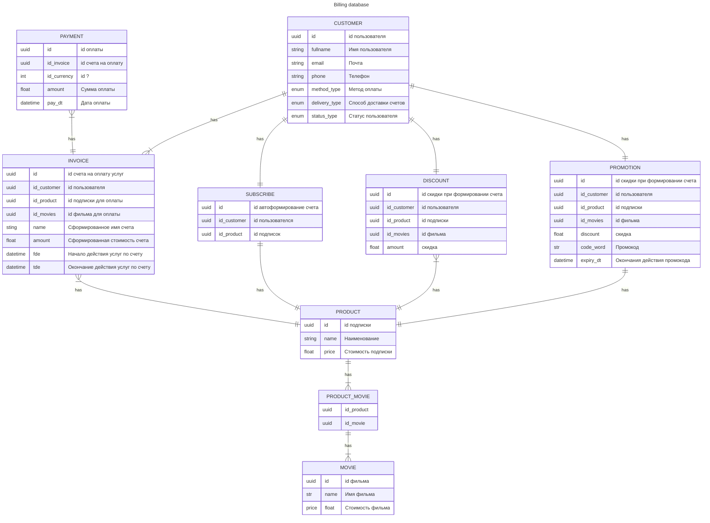

```mermaid
---
title: Billing database
---
erDiagram
CUSTOMER {
    uuid id "id пользователя"
    string fullname "Имя пользователя"
    string email "Почта"
    string phone "Телефон"
    enum method_type "Метод оплаты"
    enum delivery_type "Способ доставки счетов"
    enum status_type "Статус пользователя"
}
PAYMENT {
    uuid id "id оплаты"
    uuid id_invoice "id счета на оплату"
    int id_currency "id ?"
    float amount "Сумма оплаты"
    datetime pay_dt "Дата оплаты"
}
INVOICE { 
    uuid id "id счета на оплату услуг"
    uuid id_customer "id пользователя"
    uuid id_product "id подписки для оплаты"
    uuid id_movies "id фильма для оплаты"
    sting name "Сформированное имя счета"
    float amount "Сформированная стоимость счета"
    datetime fde "Начало действия услуг по счету"
    datetime tde "Окончание действия услуг по счету"
}
SUBSCRIBE {
    uuid id "id автоформирование счета"
    uuid id_customer "id пользователся"
    uuid id_product "id подписок"
}
DISCOUNT { 
    uuid id "id скидки при формировании счета"
    uuid id_customer "id пользователя"
    uuid id_product "id подписки"
    uuid id_movies "id фильма"
    float amount "скидка"
}
PROMOTION {
    uuid id "id скидки при формировании счета"
    uuid id_customer "id пользователя"
    uuid id_product "id подписки"
    uuid id_movies "id фильма"
    float discount "скидка"
    str code_word "Промокод"
    datetime expiry_dt "Окончания действия промокода"
}
PRODUCT {
    uuid id "id подписки" 
    string name "Наименование"
    float price "Стоимость подписки"
}

MOVIE {
    uuid id "id фильма" 
    str name "Имя фильма" 
    price float "Стоимость фильма"
}

PRODUCT_MOVIE {
    uuid id_product
    uuid id_movie
}
INVOICE }|--|| PRODUCT: has
PAYMENT }|--|| INVOICE: has
CUSTOMER  ||--|| PROMOTION: has
CUSTOMER  ||--}| INVOICE: has
CUSTOMER  ||--|| SUBSCRIBE: has
CUSTOMER  ||--|| DISCOUNT: has
SUBSCRIBE  ||--|| PRODUCT: has
DISCOUNT }|--|| PRODUCT: has
PROMOTION ||--|| PRODUCT: has
PRODUCT ||--|{ PRODUCT_MOVIE: has
PRODUCT_MOVIE ||--|{ MOVIE: has
```