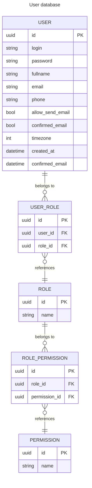

```mermaid
---
title: User database
---
erDiagram
USER {
    uuid id PK
    string login
    string password
    string fullname
    string email
    string phone
    bool allow_send_email
    bool confirmed_email
    int timezone
    datetime created_at
    datetime confirmed_email
} 
USER_ROLE {
    uuid id PK
    uuid user_id FK
    uuid role_id FK
}
ROLE {
    uuid id PK
    string name
}
PERMISSION {
    uuid id PK
    string name
}
ROLE_PERMISSION {
    uuid id PK
    uuid role_id FK
    uuid permission_id FK
}
USER ||--o{ USER_ROLE: "belongs to"
USER_ROLE }o--|| ROLE: references
ROLE ||--o{ ROLE_PERMISSION: "belongs to"
ROLE_PERMISSION }o--|| PERMISSION: references
```