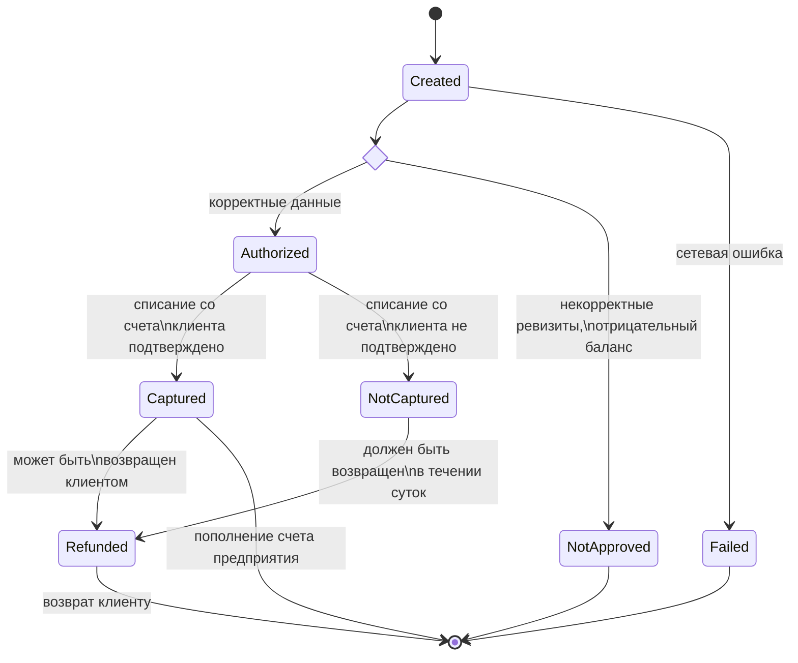

# Payment status

Status | Description         
---- |---------------------
created | Платеж передан в платежную систему, но еще не обработан.  
authorized | Реквизиты проверены, денежные средства списаны со счета клиента. Платеж возвращается клиенту, если он не будет зафиксирован.
captured | Денежные средства могут быть переданы на счет предприятия.
refunded | Платеж возвращен на счет клиента. 
failed | Неудачная попытка оплаты. 

