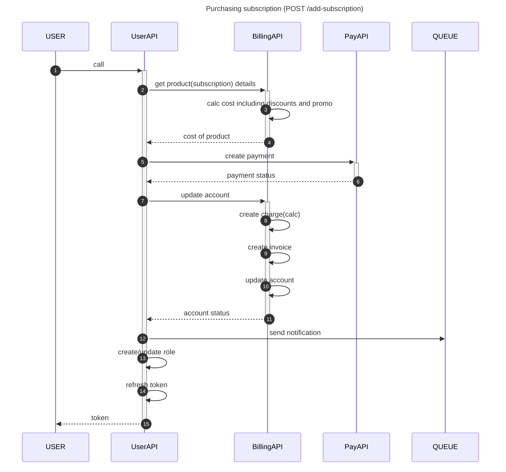

```mermaid
---
title: Purchasing subscription (POST /add-subscription)
---
sequenceDiagram
    autonumber
    participant USER
    participant UserAPI
    participant BillingAPI
    participant PayAPI
    participant QUEUE
    USER->>+UserAPI: call
    UserAPI->>+BillingAPI: get product(subscription) details
    BillingAPI->>BillingAPI: calc cost including discounts and promo
    BillingAPI-->>-UserAPI: cost of product
    UserAPI->>+PayAPI: create payment
    PayAPI-->>-UserAPI: payment status
    UserAPI->>+BillingAPI: update account
    BillingAPI->>BillingAPI: create charge(calc)
    BillingAPI->>BillingAPI: create invoice
    BillingAPI->>BillingAPI: update account
    BillingAPI-->>-UserAPI: account status
    UserAPI->>QUEUE: send notification
    UserAPI->>UserAPI: create/update role
    UserAPI->>UserAPI: refresh token
    UserAPI-->>-USER: token
```