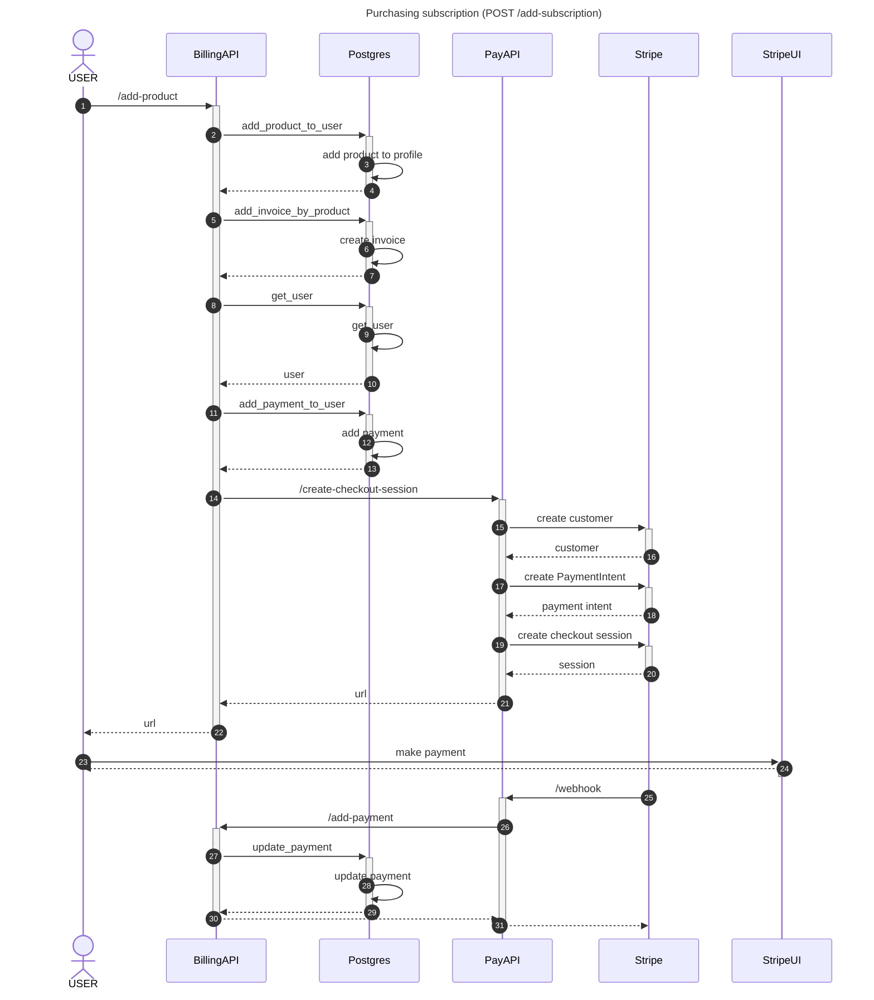

```mermaid
---
title: Purchasing subscription (POST /add-subscription)
---
sequenceDiagram
    autonumber
    actor USER
    participant BillingAPI
    participant Postgres
    participant PayAPI
    participant Stripe
    participant StripeUI
    USER->>+BillingAPI: /add-product
    BillingAPI->>+Postgres: add_product_to_user
    Postgres->>Postgres: add product to profile
    Postgres-->>-BillingAPI: 
    BillingAPI->>+Postgres: add_invoice_by_product
    Postgres->>Postgres: create invoice
    Postgres-->>-BillingAPI: 
    BillingAPI->>+Postgres: get_user
    Postgres->>Postgres: get_user
    Postgres-->>-BillingAPI: user 
    BillingAPI->>+Postgres: add_payment_to_user
    Postgres->>Postgres: add payment
    Postgres-->>-BillingAPI: 
    BillingAPI->>+PayAPI: /create-checkout-session
    PayAPI->>+Stripe: create customer
    Stripe-->>-PayAPI: customer
    PayAPI->>+Stripe: create PaymentIntent
    Stripe-->>-PayAPI: payment intent
    PayAPI->>+Stripe: create checkout session
    Stripe-->>-PayAPI: session
    PayAPI-->>-BillingAPI: url
    BillingAPI-->>-USER: url
    USER->>+StripeUI: make payment
    StripeUI-->>-USER: 
    Stripe->>+PayAPI: /webhook
    PayAPI->>+BillingAPI: /add-payment
    BillingAPI->>+Postgres: update_payment
    Postgres->>Postgres: update payment
    Postgres-->>-BillingAPI: 
    BillingAPI-->>-PayAPI: 
    PayAPI-->>-Stripe: 
```