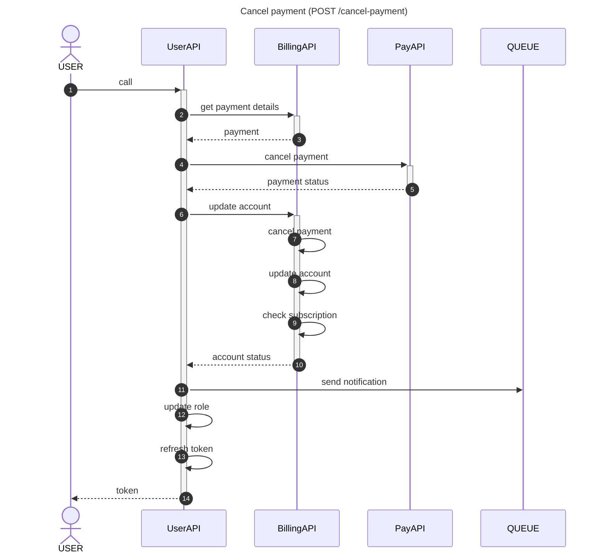

```mermaid
---
title: Cancel payment (POST /cancel-payment)
---
sequenceDiagram
    autonumber
    actor USER
    participant UserAPI
    participant BillingAPI
    participant PayAPI
    participant QUEUE
    USER->>+UserAPI: call
    UserAPI->>+BillingAPI: get payment details
    BillingAPI-->>-UserAPI: payment
    UserAPI->>+PayAPI: cancel payment
    PayAPI-->>-UserAPI: payment status
    UserAPI->>+BillingAPI: update account
    BillingAPI->>BillingAPI: cancel payment
    BillingAPI->>BillingAPI: update account
    BillingAPI->>BillingAPI: check subscription
    BillingAPI-->>-UserAPI: account status
    UserAPI->>QUEUE: send notification
    UserAPI->>UserAPI: update role
    UserAPI->>UserAPI: refresh token
    UserAPI-->>-USER: token
```