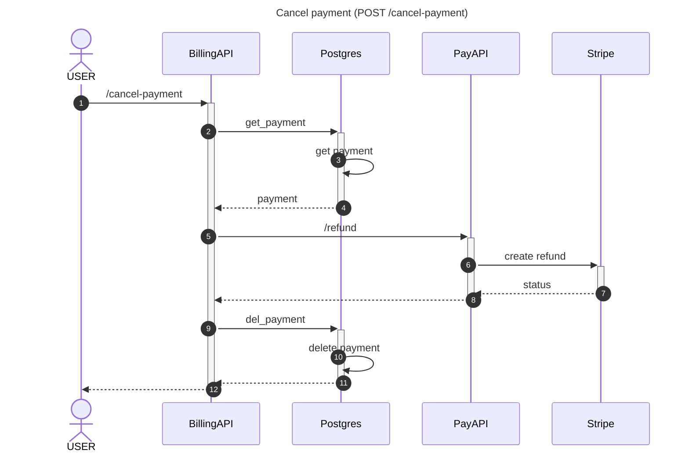

```mermaid
---
title: Cancel payment (POST /cancel-payment)
---
sequenceDiagram
    autonumber
    actor USER
    participant BillingAPI
    participant Postgres
    participant PayAPI
    participant Stripe
    USER->>+BillingAPI: /cancel-payment
    BillingAPI->>+Postgres: get_payment
    Postgres->>Postgres: get payment
    Postgres-->>-BillingAPI: payment
    BillingAPI->>+PayAPI: /refund
    PayAPI->>+Stripe: create refund
    Stripe-->>-PayAPI: status
    PayAPI-->>-BillingAPI: 
    BillingAPI->>+Postgres: del_payment
    Postgres->>Postgres: delete payment
    Postgres-->>-BillingAPI: 
    BillingAPI-->>-USER: 
```