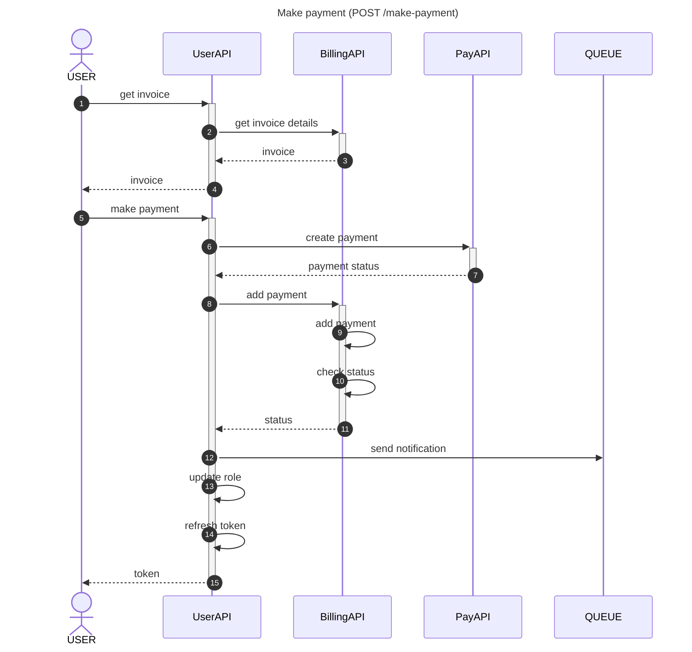

```mermaid
---
title: Make payment (POST /make-payment)
---
sequenceDiagram
    autonumber
    actor USER
    participant UserAPI
    participant BillingAPI
    participant PayAPI
    participant QUEUE
    USER->>+UserAPI: get invoice
    UserAPI->>+BillingAPI: get invoice details
    BillingAPI-->>-UserAPI: invoice
    UserAPI-->>-USER: invoice
    USER->>+UserAPI: make payment
    UserAPI->>+PayAPI: create payment
    PayAPI-->>-UserAPI: payment status
    UserAPI->>+BillingAPI: add payment
    BillingAPI->>BillingAPI: add payment
    BillingAPI->>BillingAPI: check status
    BillingAPI-->>-UserAPI: status
    UserAPI->>QUEUE: send notification
    UserAPI->>UserAPI: update role
    UserAPI->>UserAPI: refresh token
    UserAPI-->>-USER: token
```