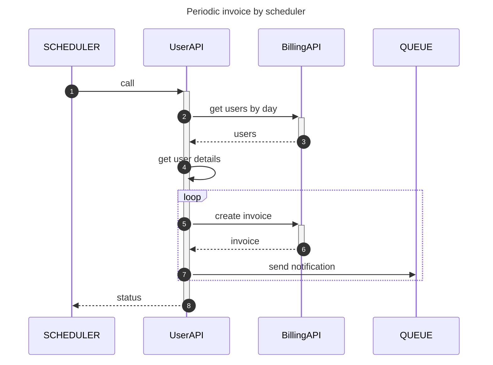

```mermaid
---
title: Periodic invoice by scheduler
---
sequenceDiagram
    autonumber
    participant SCHEDULER
    participant UserAPI
    participant BillingAPI
    participant QUEUE
    SCHEDULER->>+UserAPI: call
    UserAPI->>+BillingAPI: get users by day
    BillingAPI-->>-UserAPI: users
    UserAPI->>UserAPI: get user details
    loop 
        UserAPI->>+BillingAPI: create invoice
        BillingAPI-->>-UserAPI: invoice
        UserAPI->>QUEUE: send notification
    end
    UserAPI-->>-SCHEDULER: status
```